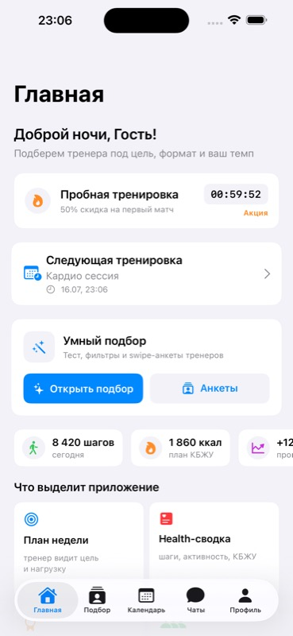

# Pump App

[](https://github.com/Win4ez-ru/pump_app/actions/workflows/ios-ci.yml)

SwiftUI fitness platform prototype that connects clients with personal trainers and keeps training, progress, chat, and profile workflows in one app.

## Product highlights

- Firebase email/password authentication with an optional guest experience.
- Trainer discovery with goal, format, experience, gender, age, and specialization filters.
- Match scoring, trainer requests, and client/trainer mode concepts.
- Training calendar with create, update, and delete workflows.
- Weight, activity, and progress dashboards.
- Chat, profile, career, and settings experiences.
- Adaptive SwiftUI components and reusable form controls.

## Preview

<p>
  
  
</p>

## Stack

- Swift and SwiftUI
- MVVM and ObservableObject state management
- Firebase Authentication and Cloud Firestore
- Swift Package Manager
- Swift Charts
- iOS 18+ / Xcode 26

## Project structure

```text
App/           Application entry point and tab navigation
Core/          Services, constants, and shared utilities
Features/      Authentication, home, training, matching, chat, profile, settings
Models/        User, training, weight, and fitness domain models
Shared/        Reusable buttons, forms, and indicators
Assets.xcassets/
```

The repository keeps feature views and view models together while shared services isolate Firebase authentication and training state. The current trainer catalog is local prototype data, making the main discovery flow deterministic and easy to demo.

## Run locally

1. Open `pump_app.xcodeproj` in Xcode 26 or newer.
2. Select the `pump_app` scheme and an iOS 18+ simulator.
3. Confirm `GoogleService-Info.plist` belongs to a Firebase project you control.
4. Enable Email/Password Authentication and create a Cloud Firestore database.
5. Apply restrictive Firestore rules before using real accounts.
6. Build and run.

The app also supports a guest path for reviewing the interface without creating an account.

## Build from the command line

```bash
xcodebuild build \
  -project pump_app.xcodeproj \
  -scheme pump_app \
  -destination 'platform=iOS Simulator,name=iPhone 17,OS=latest' \
  CODE_SIGNING_ALLOWED=NO
```

GitHub Actions runs this build on every push and pull request.

## Firebase security

`GoogleService-Info.plist` is client configuration, not a substitute for backend authorization. A production Firebase project should use per-user Firestore rules, App Check, separate development and production projects, and only the Authentication providers the app requires. A deny-by-default starting point is included in [`firebase/firestore.rules`](firebase/firestore.rules).

See [`SECURITY.md`](SECURITY.md) for repository security expectations.

## Status

This repository is an actively developed portfolio prototype. Authentication and the main UI compile and run; trainer discovery and training content still use local fixtures in several flows. The next engineering milestones are persistence for training and matching, automated tests, smaller feature components, and release screenshots and icons.
